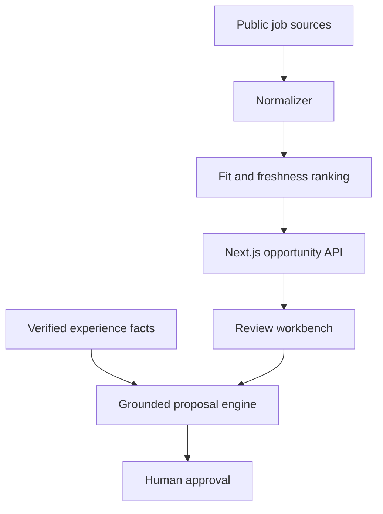

# Freelance OS · AI Opportunity Workbench

[](https://github.com/crz0614/ai-freelance-workbench/actions/workflows/ci.yml)

**[Live demo](https://ai-freelance-workbench.vercel.app)**

A privacy-safe AI workflow that discovers, ranks and turns technical opportunities into grounded proposals.

**This public deployment rechecks multiple public sources and shows only current cash opportunities.** It never inserts fallback opportunities when a source is empty or unavailable. It does not contain résumés, email addresses, application history, OAuth tokens, browser sessions, cookies or production credentials.

## What it demonstrates

- A polished responsive Next.js and TypeScript interface
- Live collectors for GitHub plus Algora, Opire, Polar and IssueHunt references, payment-verified Freelancer projects, Remotive contracts and Remote OK contracts
- Hard removal of stale, filled/rewarded, unsafe, unpriced and crowded work; direct projects expire after 14 days and all other listings after 30 days
- Source health with kept and rejected counts, five-minute browser refresh and no-cache API responses
- Search, source filtering, match explanations and pipeline metrics
- Grounded proposal drafting with an explicit no-invention guardrail
- A public API at `/api/opportunities`
- A server-side SQLite foundation that snapshots verified opportunities and persists pipeline stages, notes and proposal drafts through `/api/workspace`
- Automated tests, linting, production builds, Docker and GitHub Actions

## Run locally

```bash
npm ci
npm run dev
```

Open `http://localhost:3000`. No API key is required for demo mode.

Run `docker compose up --build` for the persistent single-operator deployment. Its named volume survives container restarts and `/api/health` verifies database access. Put it behind your own authentication proxy before exposing workspace write APIs publicly. The Vercel demo uses ephemeral storage and is not advertised as a durable application database.

## Quality checks

```bash
npm test
npm run lint
npm run build
docker build -t ai-freelance-workbench .
```

## Architecture



Provider adapters run server-side, normalize public results to one opportunity contract, and preserve the original URL. Empty or failed sources are reported honestly instead of being replaced by sample records. See [Architecture](docs/ARCHITECTURE.md) and [API documentation](docs/API.md).

## 中文说明

这是一个隐私安全的 AI 外包机会工作台，覆盖多渠道机会发现、统一数据结构、匹配排序，以及基于已验证经历生成申请方案的完整流程。

公开版实时核验 GitHub 以及 Algora、Opire、Polar、IssueHunt 付款引用、通过客户付款验证的 Freelancer 固定价项目、Remotive 合同和 Remote OK 合同来源；采集失败或没有结果时会明确显示，不会补入虚构岗位。直接项目超过 14 天、其他任务超过 30 天，或已招满、已奖励、非现金、不安全、竞争过高、客户付款未验证时，都会在进入工作台前删除。

主要能力：

- Next.js、React、TypeScript 全栈开发
- 多来源岗位标准化与筛选
- 技能匹配解释与机会排序
- 不编造经历的 AI 申请方案工作流
- API、自动化测试、CI、Docker 和生产部署
- 自托管模式下的服务器 SQLite：保存真实机会快照、Pipeline 阶段、备注和申请草稿

## Security

- Secrets belong only in server-side environment variables.
- `.env*` is ignored except `.env.example`.
- The public Vercel demo uses ephemeral storage; persistent self-hosting is intended for one trusted operator behind authentication.
- Proposal claims must come from verified experience facts.
- A human approval step remains before any external submission.

## License

MIT
